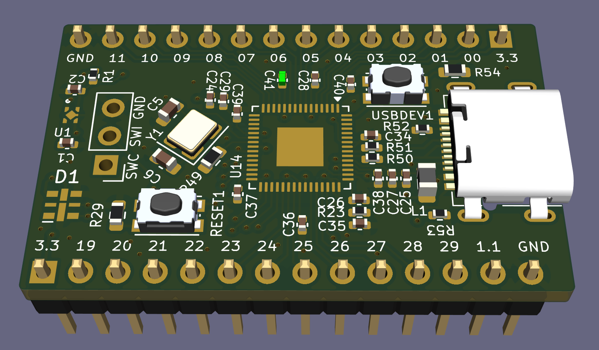

# RP2354A
Kicad design for a minimal RP2354A based devboard, based on the original files from Raspberry Pi. Made in a small form factor, 2-layer board that can be produced anywhere. I'll update the repo with more images once I've made some copies myself.

Feel free to use this as a starting point for your own projects. [Contact me](https://maketronics.no/about/) for consulting and custom hardware based around RP2354A or other hardware.

