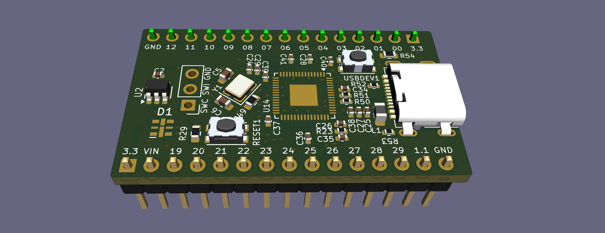
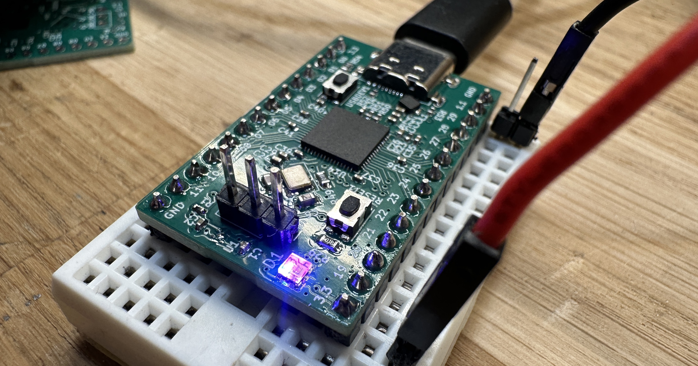

# RP2354A
Kicad design for a minimal RP2354A based devboard, based on the original files from Raspberry Pi. Made in a small form factor, 2-layer board that can be produced anywhere. I'll update the repo with more images once I've made some copies myself.

Feel free to use this as a starting point for your own projects. [Contact me](https://maketronics.no/about/) for consulting and custom hardware based around RP2354A or other hardware.

Raspberry Pi MPN used for test board: SC1511(13)-A4.

## Versions
- v1.1 Swapped the TCR8BM33A for a more easily available and cheaper AP2112K-3.3. Takes more space, but just works. The extra space allowed one more pin on each side, so VIN/USB and IO12 is now broken out.
- v1.0 used the Toshiba LDO TCR8BM33A. This is just to fiddly for DIY boards and due to poor datasheet, I got the bias wrong.

